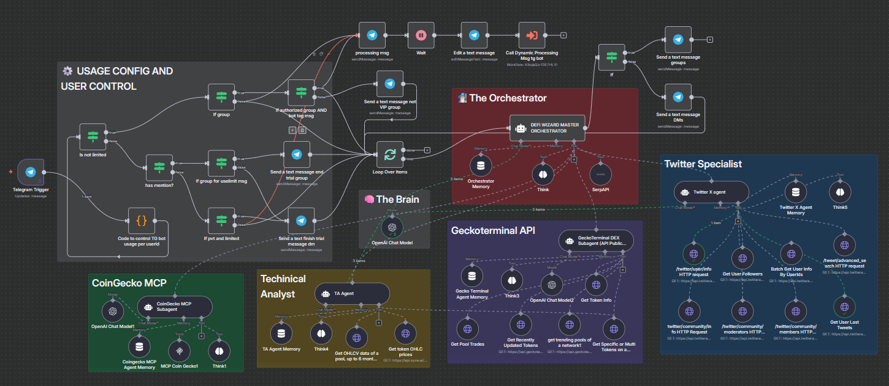

# ⚙️ Core Capabilities

<figure><figcaption>
Defi Wizard Agent Swarm v1
</figcaption></figure>


#### 🧙‍♂️ Orchestrated Intelligence

Defi Wizard isn’t a single agent — it’s a **guild of specialized AI agents**, each working in sync. The **Defi Wizard Master Orchestrator** delegates tasks to sub-agents and synthesizes results into:

* Concise, actionable recommendations
* Multi-layered context (price, trend, sentiment, risk)

Defi Wizard identifies and resolves token identities by **name**, **ticker**, or **contract address** across **100+ blockchains** extracting deep token metadata from multiple sources.&#x20;

This foundational layer enables all other agents to perform accurate downstream analysis. This orchestration allows the system to deliver **alpha-grade insights** without overwhelming you with noise.

***

#### 📈 Market Intelligence

Defi Wizard monitors CEX and DEX trends delivering real-time market context through:

* Volume surges and dumps
* Liquidity changes and slippage risks
* Centralized vs decentralized price deltas
* Trending tokens and ecosystem momentum

The system continuously scans for **micro-opportunities**, helping users catch early signals across ecosystems.

***

#### 📊 Multi-Timeframe Technical Analysis

Using **OHLCV data**, Defi Wizard performs multi-timeframe analysis across a large range of classic and custom intervals.

Indicators & methods include:

* **RSI**, **MACD**, and **Bollinger Bands**
* **Fibonacci retracements**
* Divergences and breakouts
* Trend patterns (e.g., EMA crosses, Elliott Wave signals)

Each analysis is layered with real-time price context and risk framing, helping you spot setups without staring at charts.

***

#### 📢 Social Sentiment Tracking

Through (X) **Twitter,** Defi Wizard evaluates social traction and influencer narratives:

* Gauges **community hype** and **emerging narratives**
* Tracks **project founders**, **dev accounts**, and **influencer mentions**
* Flags **bot-like activity**, **giveaway spam**, or suspicious followings
* Extracts bios, blue-checks, and tweet quality to judge legitimacy

Sentiment data helps you assess whether a token has authentic traction or just manufactured buzz.

